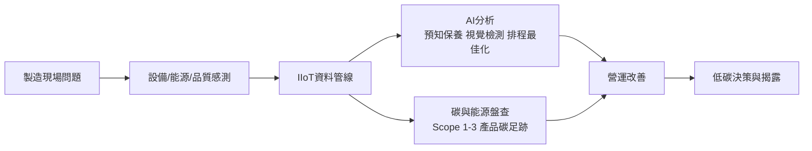
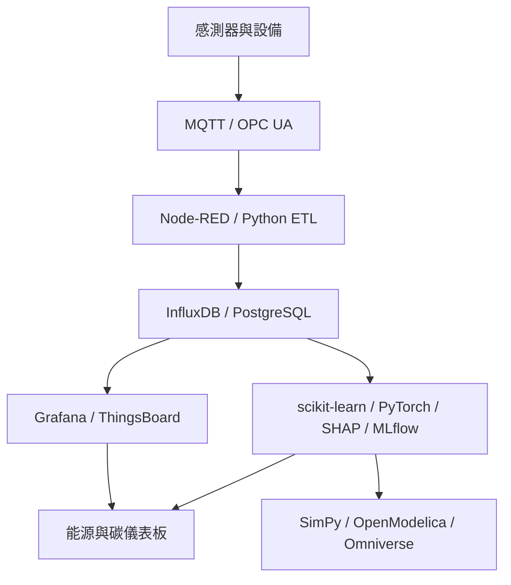
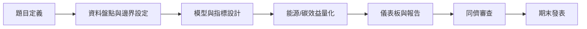

# AI在智慧製造與低碳轉型課程教學資源分析報告

## Executive Summary

本報告建議將課程定位為一門**結合製造數據、工業 AI、能源管理與碳盤查**的實作型整合課。核心邏輯不是把「智慧製造」與「低碳轉型」拆成兩門課，而是讓學生理解：製造現場的感測、聯網、模型與決策，本質上同時服務**效率、品質、韌性與減碳**四個目標。entity["organization","經濟部","taiwan ministry"]明確指出 AI 可優化生產、降低能耗並支援綠色轉型；entity["organization","CESMII","smart mfg institute"]亦將智慧製造界定為優化資源使用、降低負面環境衝擊；entity["organization","美國國家標準與技術研究院","nist us"]則提供智慧製造與可信任 AI 的方法框架。citeturn33search0turn1search5turn13search1turn1search4

課程內容宜以 entity["organization","ISO","standards body"] 14064-1／14067／50001、entity["organization","GHG Protocol","ghg accounting"] 企業盤查／Scope 3／產品標準、entity["organization","環境部","taiwan ministry"] 製造業盤查作業指引，以及 NIST AI RMF 為方法骨架；以 NASA C-MAPSS、MVTec AD、UCI Steel Plates Faults、UK-DALE、DOE IAC Database 等公開資料作為主要教學資料；再搭配 Node-RED、Mosquitto、ThingsBoard、InfluxDB、Grafana、PyTorch、OpenCV、SimPy、OpenModelica 等工具形成「從設備資料到碳與營運決策」的一條龍教學鏈。citeturn0search16turn12search0turn12search1turn19search6turn36search0turn22view4turn2search0turn31search9turn2search15turn3search0turn3search19turn4search1turn4search10turn4search19turn5search7turn7search1turn6search0turn20search0turn20search3

若未指定學期長度，建議採 **12 週**：前 6 週完成製造資料流、預兆保養、視覺檢測與模擬；後 6 週完成組織碳盤查、產品碳足跡、能源管理、案例拆解與專題整合。最終產出應至少包含三項：**可執行資料管線、可解釋 AI 模型、可追溯碳/能源報告**。這樣的設計最能對接台灣 2050 淨零政策、製造業低碳化智慧化補助方向，以及國際供應鏈揭露與合規需求。citeturn33search1turn33search4turn12search3turn21search0

## 課程定位與學習成效

本課建議對象為大三以上或碩士班學生，先備知識以 **Python 基礎、統計概念、製造流程常識**為佳；若先備條件未指定，建議在第 1 週加入 90 分鐘的 Python 與資料清理補強。課程定位可設定為「3 學分、講授 40%、實作 40%、專題 20%」。在政策與產業脈絡上，台灣已將淨零轉型列為國家行動計畫重點；環境部對指定對象亦要求盤查、登錄與查驗時程；因此課程應同時回應**工程技能**與**治理能力**。citeturn33search1turn22view4turn13search10

| 學習成效 | 具體可衡量指標 | 佐證成果 |
|---|---|---|
| 製造資料理解 | 能完成 1 份產線資料字典、設備/能源/品質 KIP 清單，並正確說明 OEE、良率、能耗、tCO2e 關聯 | 週一作業、資料字典報告 |
| IIoT 與資料管線實作 | 能建出 1 條 MQTT/OPC UA → ETL → 時序資料庫 → 儀表板流程，資料延遲控制在課堂設定門檻內 | Lab 2–3、儀表板展示 |
| AI 模型建立 | 能完成 1 個預兆保養模型與 1 個視覺/品質模型，並提交準確率/F1 或 RMSE、MAE 等指標 | Lab 4–5、模型卡 |
| 碳管理與盤查 | 能依 ISO 14064-1 / GHG Protocol 畫出組織邊界、Scope 1–3 對照、排放計算表與查驗文件需求 | Lab 7–8、盤查報告 |
| 能源與減碳決策 | 能提出 1 份節能或減碳方案，含基準線、改善假設、投資回收與減碳量估算 | 期中小專題 |
| 可信任 AI 與法規遵循 | 能以 NIST AI RMF、個資與碳數據可信度要求檢核專題 | 期末專題、風險清單 |

下圖可作為全課的能力主線：從現場資料到 AI 分析，再到能源與碳決策，對應 ISO/GHG Protocol 的可追溯要求與 NIST AI RMF 的可信任要求。citeturn1search5turn19search6turn13search9turn22view4

## 週次規劃與教學資源

本文採 12 週設計；若學校採 14 週，可在第 6 週與第 11 週之後各增加一週「產線數位孿生深化」與「供應鏈 Scope 3/CBAM 實作」。citeturn12search3turn36search0

| 週次 | 講義/投影片主題與重點頁數 | 推薦閱讀 | 實作練習與範例檔名 | 範例資料集 | 所需工具 | 評量方式 |
|---|---|---|---|---|---|---|
| 第 1 週 | **智慧製造與低碳轉型總覽**（22–26 頁） 製造 KPI、能源 KPI、碳 KPI、課程地圖 | 經濟部智慧製造專頁、台灣總體減碳行動計畫、NIST Smart Manufacturing Framework citeturn33search0turn33search1turn1search4 | `lab01_baseline_map.ipynb`：繪製產線資料—能源—碳關聯圖 | 教師自建示例資料；未指定可用 CSV 模擬 | Python、Jupyter | 課前診斷 + 1 頁基準線圖 |
| 第 2 週 | **工廠資料架構與 IIoT**（24–28 頁） 感測器、MQTT、OPC UA、邊緣到雲 | CESMII 智慧製造定義、OPC UA 官方說明 citeturn1search5turn1search10 | `lab02_mqtt_opcua_demo.ipynb`：模擬設備資料發布/訂閱；訊號標籤標準化 | 教師模擬感測器資料 | Node-RED、Mosquitto、ThingsBoard | Lab 驗收 |
| 第 3 週 | **時序資料管理與可視化**（20–24 頁） OEE、能耗、異常告警、KPI 定義 | ISO 22400 KPI、InfluxDB、Grafana 官方文件 citeturn26search3turn4search19turn5search7 | `lab03_dashboard_build.ipynb`：建儀表板與告警規則 | 自建 OEE/能耗時序資料 | InfluxDB、Grafana、Python | 儀表板展示 |
| 第 4 週 | **預知保養與剩餘壽命預測**（24–30 頁） 特徵工程、RUL、誤差指標 | NASA C-MAPSS；5C 架構原始論文 citeturn2search0turn32search0 | `lab04_predictive_maintenance.ipynb`：RUL 預測模型 | NASA C-MAPSS citeturn2search0 | pandas、scikit-learn、PyTorch | 作業：RMSE/MAE 與誤差分析 |
| 第 5 週 | **視覺檢測與異常偵測**（24–30 頁） 分類、分割、無監督異常檢測 | MVTec AD、OpenCV、CVAT、Ultralytics YOLO citeturn31search9turn6search0turn6search21turn6search10 | `lab05_mvtec_anomaly.ipynb`：瑕疵偵測；`lab05_labeling_demo`：標註流程 | MVTec AD、Steel Plates Faults citeturn31search9turn2search15 | OpenCV、CVAT、PyTorch/YOLO | 作業：F1、PR curve、誤檢分析 |
| 第 6 週 | **數位孿生與製程模擬**（22–28 頁） 離散事件模擬、瓶頸、排程與能耗情境 | SimPy、OpenModelica、NVIDIA Omniverse、5C 架構 citeturn20search0turn20search3turn20search10turn32search0 | `lab06_simulation_twin.py`：產線瓶頸與排程情境模擬 | 自建工站流程資料；未指定 | SimPy、OpenModelica、Omniverse（選用） | 期中提案書 |
| 第 7 週 | **組織碳盤查實務**（26–32 頁） 邊界設定、活動數據、排放係數、查驗 | ISO 14064-1、GHG Protocol 中文企業盤查標準、環境部盤查作業指引 citeturn0search16turn22view6turn22view4 | `lab07_ghg_inventory.xlsx`：建立 Scope 1–3 初版排放清冊 | 環境部表單範例；教師自建工廠能源帳單 | Excel/Python | 盤查表單作業 |
| 第 8 週 | **產品碳足跡與能源管理**（24–28 頁） ISO 14067、ISO 50001、Scope 3 與供應鏈 | ISO 14067、ISO 50001、GHG Protocol Product Standard、Scope 3 Standard citeturn12search0turn12search1turn19search2turn36search0 | `lab08_product_carbon_footprint.ipynb`：BOM 與製程碳足跡試算 | BOM/製程示例；未指定 | Python、Excel、OpenLCA（選用） | 作業：產品碳足跡簡報 |
| 第 9 週 | **能源資料分析與需求預測**（22–26 頁） 負載預測、異常用能、節能機會 | UK-DALE、UCI Household Power、DOE IAC Database citeturn3search0turn3search21turn3search19 | `lab09_energy_forecast.ipynb`：異常用能偵測與節能建議 | UK-DALE、UCI power、IAC citeturn3search0turn3search21turn3search19 | pandas、scikit-learn、SHAP | 實作報告 |
| 第 10 週 | **可信任 AI、可解釋性與風險管理**（22–24 頁） 偏誤、資料品質、模型卡、治理 | NIST AI RMF、SHAP、MLflow citeturn13search9turn7search2turn7search11 | `lab10_xai_model_card.ipynb`：模型解釋與版本管理 | 前述任一模型資料集 | SHAP、MLflow | 模型卡 + 風險表 |
| 第 11 週 | **案例拆解與期中整合**（18–22 頁） 燈塔工廠、供應鏈減碳、商業化路徑 | WEF 燈塔案例、台達/台積公司永續資料 citeturn15search4turn15search1turn27search7turn28search4turn24view0turn22view1turn22view2 | `lab11_case_reverse_engineering.md`：把案例轉成可教學流程圖 | 個案公開報告 | Miro / Mermaid / PowerPoint | 期中發表 |
| 第 12 週 | **期末專題衝刺與發表**（16–20 頁） 技術、碳效益、ROI、治理風險整合 | 依專題主題自選官方/原始來源 | `capstone_final_report_template.docx` | 各組自選 | 全套工具鏈 | 期末專題、同儕評分 |

上述週次所用公開資料，以 **NASA C-MAPSS、MVTec AD、Steel Plates Faults、UK-DALE、UCI Household Power、DOE IAC Database、環境部盤查表單**最適合首次開課；它們分別覆蓋設備退化、視覺檢測、品質分類、能源監測與工業節能建議等核心任務。citeturn2search0turn31search9turn2search15turn3search0turn3search21turn3search19turn22view4

## 教材平台與投影片配置

### 必備教材與參考書目

建議把教材分成四層：**標準與法規、官方方法指南、原始論文、產業白皮書/案例**。這樣教師可避免課程過度仰賴單一廠商教材，也能讓學生知道哪些材料屬於「規範」，哪些屬於「技術實作」。citeturn0search16turn12search0turn12search1turn19search6turn13search9

| 類別 | 建議採用資源 | 教學用途 |
|---|---|---|
| 標準 | ISO 14064-1、ISO 14064-3、ISO 14067、ISO 50001、ISO 14001、ISO 22400 citeturn0search16turn26search4turn12search0turn12search1turn26search2turn26search3 | 碳盤查、查驗、產品碳足跡、能源管理、製造 KPI |
| 中文官方指南 | 環境部製造業盤查作業指引、GHG Protocol 中文企業盤查標準、台灣總體減碳行動計畫、經濟部智慧製造專頁 citeturn22view4turn22view6turn33search1turn33search0 | 台灣法規與政策脈絡、中文教學基底 |
| 原始論文 | Lee et al. 2015 5C 架構、Kusiak 2018 Smart Manufacturing、Bergmann et al. 2019 MVTec AD、NIST Smart Manufacturing / Reference Architecture citeturn32search0turn31search0turn31search2turn1search23 | 製造 AI、架構設計、視覺檢測 |
| 白皮書/案例 | WEF Global Lighthouse Network 2023/2025/2026、台達永續資料、台積公司永續與 SDGs/氣候報告 citeturn15search11turn15search18turn15search2turn24view0turn22view1turn22view2 | 案例討論、專題對標 |

### 推薦實作平台與工具清單

下圖是最實用的教學工具堆疊：前端以 MQTT/OPC UA 連接資料，中層以 ETL 與時序資料庫整理，後端用 ML、模擬與碳盤查做決策。citeturn1search10turn4search16turn4search19turn5search7turn7search1turn20search3

| 工具 | 用途 | 難度 | 建議授課時長 | 開源/商業 | 安裝或帳號需求 |
|---|---|---:|---:|---|---|
| Python + pandas / scikit-learn | 資料清理、特徵工程、基礎 ML | 低 | 6–9 小時 | 開源 | 本機安裝；無帳號 |
| PyTorch | 深度學習、視覺與時序模型 | 中高 | 6–9 小時 | 開源 | 建議 GPU；無帳號 |
| SHAP + MLflow | 可解釋 AI、模型版本控管 | 中 | 3–4 小時 | 開源 | 本機或伺服器 |
| Node-RED | 低程式門檻的事件流、資料收集與轉換 | 低 | 2–3 小時 | 開源 | 本機/Docker |
| Eclipse Mosquitto | MQTT broker，設備到平台的訊息中介 | 低 | 1–2 小時 | 開源 | 本機/Docker |
| ThingsBoard | IoT 資料收集、裝置管理、即時儀表板 | 中 | 3–4 小時 | 開源社群版 / 商業版 | 本機或雲端 |
| InfluxDB + Grafana | 時序資料儲存與監控可視化 | 中 | 3–4 小時 | 開源 / 商業雲 | 本機、Docker 或雲帳號 |
| AWS IoT SiteWise | 工業設備資料收集、資產模型、跨廠監控 | 中 | 2–3 小時 | 商業 | AWS 帳號；教育額度可議 |
| Azure IoT Operations | 邊緣資料平面、Kubernetes/Arc 工業連接 | 高 | 3–4 小時 | 商業 | Azure 帳號，需 Arc/K8s |
| SimPy / OpenModelica | 離散事件模擬、流程/能耗情境分析 | 中 | 4–6 小時 | 開源 | 本機安裝 |
| NVIDIA Omniverse | 視覺化數位孿生、工廠模擬與 AI 整合 | 高 | 4–6 小時 | 商業（教學可選用） | NVIDIA 帳號與較高 GPU 規格 |
| OpenCV + CVAT + YOLO | 影像標註、訓練、瑕疵檢測 | 中 | 6–8 小時 | 開源 | 本機或伺服器 |
| OpenEMS / OpenEnergyMonitor | 開源能源管理與監測 | 中 | 2–4 小時 | 開源 | 本機/Raspberry Pi |
| EcoStruxure Resource Advisor | 企業級能源/永續/碳資料管理 | 中 | 2 小時示範 | 商業 | 企業帳號；價格未指定/需詢價 |

工具能力敘述主要根據官方文件：Node-RED 強調低程式門檻與即時資料處理，Mosquitto 為輕量 MQTT broker，ThingsBoard 提供裝置管理與可視化，AWS IoT SiteWise 與 Azure IoT Operations 分別對應雲端工業資料收集與邊緣資料平面，OpenCV/CVAT/Ultralytics 支援工業視覺標註與訓練，OpenEMS 與 Resource Advisor 則分別對應開源與企業級能源管理。citeturn4search16turn4search1turn4search10turn5search0turn5search1turn6search0turn6search21turn6search10turn35search7turn35search4

### 教學投影片與實作範例目錄化清單

建議每週投影片採 **1 個主題 deck + 1 個 lab deck**。主題 deck 以概念、方法、案例為主；lab deck 聚焦操作步驟、資料欄位、評量指標。檔名可統一如下：`W01_intro_smart_mfg_decarbonization.pdf`、`W02_iiot_pipeline_lab.pdf`、`W03_kpi_dashboard.pdf`、`W04_predictive_maintenance.pdf`、`W05_machine_vision_qc.pdf`、`W06_digital_twin_simulation.pdf`、`W07_ghg_inventory.pdf`、`W08_product_carbon_energy_mgmt.pdf`、`W09_energy_analytics.pdf`、`W10_trustworthy_ai.pdf`、`W11_case_reverse_engineering.pdf`、`W12_capstone_demo_day.pdf`。投影片重點頁數以上表所列 16–32 頁為宜；超過 32 頁時，建議拆成「講授版」與「實作版」。  

## 案例研究與實作專題

### 範例案例研究

entity["organization","世界經濟論壇","wef"]的燈塔網絡顯示，AI、數位孿生、知識圖譜、IIoT 與能源/碳資料平台已能同時拉動生產力與減碳績效；台灣企業案例則特別適合作為供應鏈與碳盤查教學素材。citeturn9search3turn28search14

| 案例 | 摘要 | 關鍵技術 | 成效指標 | 公開資料/報告 | 可模擬的教學活動 |
|---|---|---|---|---|---|
| **entity["company","台達電子","power electronics"]** | 以內部碳費、再生電力、綠建築與能資源管理推動企業減碳 | 內部碳定價、再生電力、ISO 14064-3 查證 | 2024 全球據點 Scope 1+2（市場別）較基準年減量 53.6%；內部碳價每噸 300 美元 citeturn24view0 | 2024 ESG/公司治理揭露資料 citeturn24view0 | 模擬「廠務節能專案排序」與內部碳費資本配置 |
| **entity["company","台積公司","semiconductor foundry"]** | 把供應鏈韌性、設備節能與綠色工廠納入營運 | 高效率變壓器、供應商異常改善、製程減排設備 | 供應商專案使產線異常降 84%，年省電 115.5 萬 kWh、減碳 572 噸；導入 2,435 台高效率變壓器，累計省電 8,500 萬 kWh、減碳 40,199 噸；3,436 台局部洗滌設備與碳中和天然氣減少直接排放 39 萬噸 citeturn22view1turn22view2 | 2024 SDGs Action Report、2024 Sustainability Report citeturn22view1turn22view2 | 模擬「設備更新—節能—碳效益」投資回收分析 |
| **entity["company","Schneider Electric","energy automation"]** Le Vaudreuil | 燈塔工廠把 IIoT 與數位平台導入能源與材料管理 | IIoT、數位平台、工廠能源管理 | 能源管理改善 25%、材料浪費降 17%、CO2 排放降 25% citeturn15search0turn15search4 | WEF/公司新聞稿 citeturn15search0turn15search4 | 讓學生重建其「能源—物料—碳」 KPI 樹 |
| **entity["company","Siemens","industrial technology"]** Erlangen | 以 AI、數位孿生與機器人改造中量多樣電子製造 | 100+ AI 演算法、數位孿生、機器人 | 勞動生產力 +69%、能源消耗 -42%、上市時間縮短 40% citeturn15search1turn15search13 | WEF/公司新聞稿 citeturn15search1turn15search13 | 專題：用模擬方法比較「現況排程」與「AI 輔助排程」 |
| **entity["company","Foxconn Industrial Internet","electronics manufacturing"]** Bac Ninh | 為供應鏈與工廠同時減碳，導入 AI 綠色設計、生成式 AI 碳平台與 Omniverse + AI 能效優化 | GenAI 碳平台、綠色設計、Omniverse | Scope 3 排放降 22%，Scope 1+2 排放降 34%；另有案例指出碳足跡降 56%，並協助 13 家供應商取得碳中和認證 citeturn27search2turn27search7 | WEF、鴻海新聞稿 citeturn27search3turn27search7 | 模擬「中小供應商碳盤查平台」需求規格書 |
| **entity["company","Haier","home appliance"]** Hefei | 將進階演算法、數位孿生、知識圖譜用於研發、生產與測試 | 進階演算法、數位孿生、知識圖譜 | 能效 +33%、缺陷率 -58%、勞動生產力 +49%、單位製造成本 -22% citeturn28search4 | WEF 公開案例 citeturn28search4 | 讓學生拆解「知識圖譜 + 雙生」如何支持多品種生產 |

### 實作專題題庫

以下題庫兼顧**製造 AI**與**低碳管理**。若學生背景偏資訊，可優先前 6 題；若偏工管/永續，可優先後 6 題。

| 題目 | 難度 | 預估工時 | 可用資料集 | 評分指標 |
|---|---|---:|---|---|
| 預知保養：RUL 預測 | 中 | 18–24 小時 | NASA C-MAPSS | RMSE/MAE、特徵解釋、部署可行性 |
| 瑕疵影像異常偵測 | 中 | 18–24 小時 | MVTec AD | AUROC/F1、誤檢分析 |
| 鋼板缺陷分類與 SHAP 解釋 | 中 | 12–18 小時 | Steel Plates Faults | F1、可解釋性 |
| 工廠能耗異常用電偵測 | 中 | 12–18 小時 | UK-DALE / UCI power | 偵測率、節能建議品質 |
| MQTT 到儀表板即時管線 | 低 | 10–14 小時 | 模擬感測器資料 | 穩定性、資料完整率、視覺化 |
| 產線瓶頸與排程雙生 | 中高 | 18–24 小時 | 自建工站資料 | throughput、WIP、能耗情境 |
| ISO 14064-1 組織盤查器 | 中 | 14–20 小時 | 教師自建工廠帳單/燃料資料 | 邊界正確性、查核可追溯性 |
| 產品碳足跡試算器 | 中 | 14–20 小時 | BOM + 製程示例 | 假設透明度、敏感度分析 |
| Scope 3 採購熱點分析 | 中高 | 18–24 小時 | 供應商採購模擬資料 | 類別映射、熱點識別、減量方案 |
| DOE IAC 節能提案排序器 | 中 | 12–16 小時 | IAC Database | ROI、減碳量、建議可行性 |
| 邊緣 AI 視覺檢測 PoC | 高 | 20–30 小時 | MVTec AD / 自拍資料 | FPS、F1、硬體部署 |
| 碳/能雙目標決策儀表板 | 中高 | 18–24 小時 | 綜合自建資料 | 指標一致性、管理可用性 |

題庫主要對應 NASA C-MAPSS、MVTec AD、Steel Plates Faults、UK-DALE、UCI Household Power、DOE IAC Database 以及 ISO/GHG Protocol/環境部盤查模板。citeturn2search0turn31search9turn2search15turn3search0turn3search21turn3search19turn22view4turn22view6

## 評量預算與風險治理

### 評量設計建議

| 評量項目 | 比例 | 建議內容 | 評分重點 |
|---|---:|---|---|
| 平時作業 | 20% | 4 次短作業：資料字典、KPI、盤查邊界、案例摘要 | 正確性、完整性、表達 |
| 實作報告 | 20% | 4 次 Lab 報告 | 可重現性、圖表品質、結果解讀 |
| 期中專題 | 20% | 小組完成「資料流 + 模型 + 初步碳效益」 | 技術可行、問題定義清晰 |
| 期末專題 | 30% | 完整 PoC、儀表板、碳/能源分析與商業建議 | 技術 40、碳效益 25、治理風險 15、展示 20 |
| 同儕評分與參與 | 10% | 組內互評 + 課堂提問/回饋 | 貢獻度、合作、專業回饋 |

同儕評分範本建議用五個構面，各 1–5 分：**問題定義、資料品質、模型可靠性、碳效益量化、簡報清晰度**。期末專題要明確要求附上 **資料來源表、模型卡、盤查假設表、版本紀錄**，避免只交漂亮 dashboard 而缺乏治理證據。

### 預算估算表

下表以 **30 人課、6 組**進行估算，採「最低可開課版本」與「擴充版」。未指定品牌之項目，以教學市場常見區間估算；商業授權如無公開價格，標示為「未指定／需詢價」。

| 項目 | 數量 | 單價範圍 | 總價估算 | 教育折扣/替代 |
|---|---:|---:|---:|---|
| Raspberry Pi 5 邊緣節點 | 6 | NT$2,500–4,000 | NT$15,000–24,000 | 可用舊 PC/虛擬機替代 |
| Jetson Orin Nano Super 開發套件 | 2 | NT$8,500–11,500 | NT$17,000–23,000 | 非必備；可改用校內 GPU 主機 |
| USB/工業相機 | 3 | NT$2,000–15,000 | NT$6,000–45,000 | 可先用一般 USB 攝影機 |
| 智慧電表/插座/感測模組 | 12 | NT$800–2,500 | NT$9,600–30,000 | 可先以公開資料集替代 |
| 小型交換器、線材、電源 | 1 批 | NT$5,000–10,000 | NT$5,000–10,000 | 基礎網通可由實驗室支援 |
| GPU 伺服器租用或校內時數 | 未指定 | NT$10,000–40,000/學期 | NT$10,000–40,000 | 若使用 CPU/較小模型可降載 |
| 商業雲服務額度 | 未指定 | NT$0–20,000 | NT$0–20,000 | AWS/Azure 教育額度爭取 |
| AnyLogic / 商業模擬授權 | 未指定 | 未指定／需詢價 | 未指定 | 可改用 SimPy / OpenModelica |
| 合計 |  |  | **基礎版約 NT$62,600–192,000** | 開源替代可再下降 |

官方資訊顯示，Raspberry Pi 5 記憶體型號價格差異大；Jetson Orin Nano Super 開發套件官方價格為 US$249；AnyLogic 提供免費 PLE 與教育/研究方案，但進階授權需詢價。因此，最穩妥的開課方式是先採**開源軟體 + 少量硬體共享**，把預算集中在 2 台邊緣 AI 裝置與 1 套視覺檢測教具即可。citeturn30search8turn30search5turn30search2turn30search10

### 風險與倫理考量

本課至少要把四類風險納入教學。第一是**資料隱私與員工監控邊界**：台灣個資法以規範個人資料之蒐集、處理與利用為核心，並要求告知蒐集目的、類別、利用期間與當事人權利，因此相機、工號、位置、維修紀錄只要能識別個人，就不能把「改善效率」當成無上限的資料蒐集理由。citeturn34search3turn34search7

第二是**碳數據可信度**：環境部指引要求指定對象保存活動數據、熱值/含碳量與排放係數來源，盤查結果須於每年 4 月 30 日前登錄，指定查驗者須於 10 月 31 日前上傳查驗結果；ISO 14064-3 則對驗證/查證提出程序要求。也就是說，課堂上若要教學生做碳儀表板，不能只教計算公式，還要教**資料來源、版本控管與查驗證據**。citeturn22view4turn26search4

第三是**模型偏誤與不當自動化**：NIST AI RMF 把可信任 AI 定義為一種全生命週期風險管理問題，製造場域尤其要注意資料漂移、標註偏差、黑箱決策對維修/排程/品保人員的影響。建議所有專題都要求附「模型卡 + 失效情境 + 人工覆核點」。citeturn13search9turn13search5

第四是**產業法規與供應鏈合規**：EU CBAM 已明確聚焦進口商品的嵌入排放；IFRS S2 要求企業揭露與氣候風險、機會、治理、策略、風險管理與指標相關資訊。課程若忽略揭露與合規，只教演算法，將無法回答企業真正的用人需求。citeturn12search3turn12search7turn21search0

建議課內固定討論題如下：  
一，若缺陷檢測攝影機同時拍到人員動作，哪些資料能留、哪些不能留？  
二，若排放係數版本更新，歷史 dashboard 是否必須重算？  
三，當 AI 模型提升良率卻增加總耗電時，應如何判斷是否「更永續」？  
四，供應商只給平均值不給原始表單時，能否納入 Scope 3？  
五，若工廠要對外宣稱減碳成效，哪些數據至少要到合理保證或有限保證？  

## 開放問題與限制

本報告已優先採官方、原始與中文來源，但仍有三點限制。其一，部分燈塔工廠案例頁面採互動式網頁，若全文抓取受限，文中部分量化數值來自 entity["organization","世界經濟論壇","wef"] 或公司官方搜尋摘要，而非完整 PDF 內文；不過所採用者皆為官方來源摘要。citeturn15search4turn15search1turn27search7turn28search4 其二，商業軟體授權與工業相機價格高度依採購地區、教育折扣與規格而變動，因此本文將相關項目標示為估算或未指定。其三，若授課對象無 Python 或製造背景，建議在正式 12 週前外加 1–2 週先修單元；此部分屬教學設計建議，非官方標準要求。
